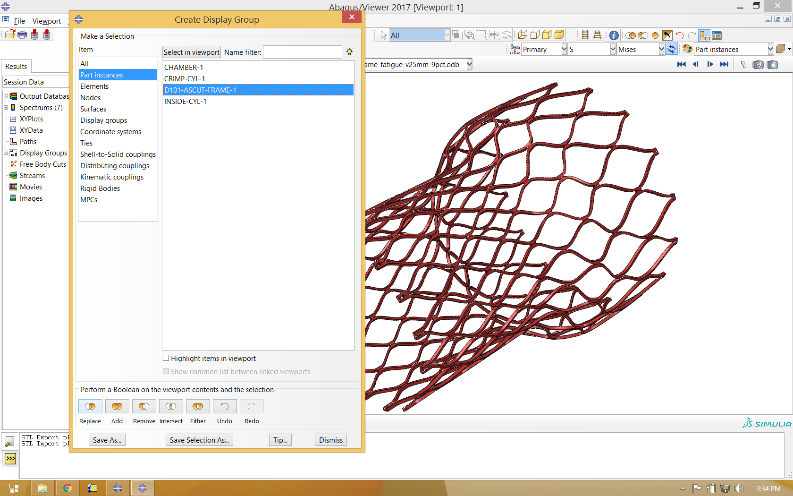
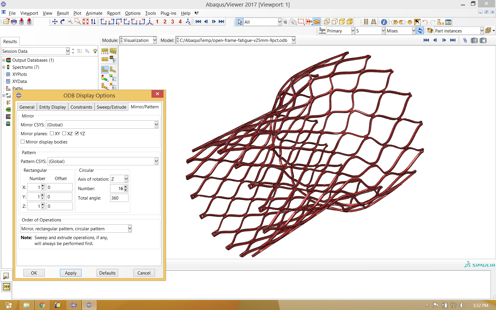
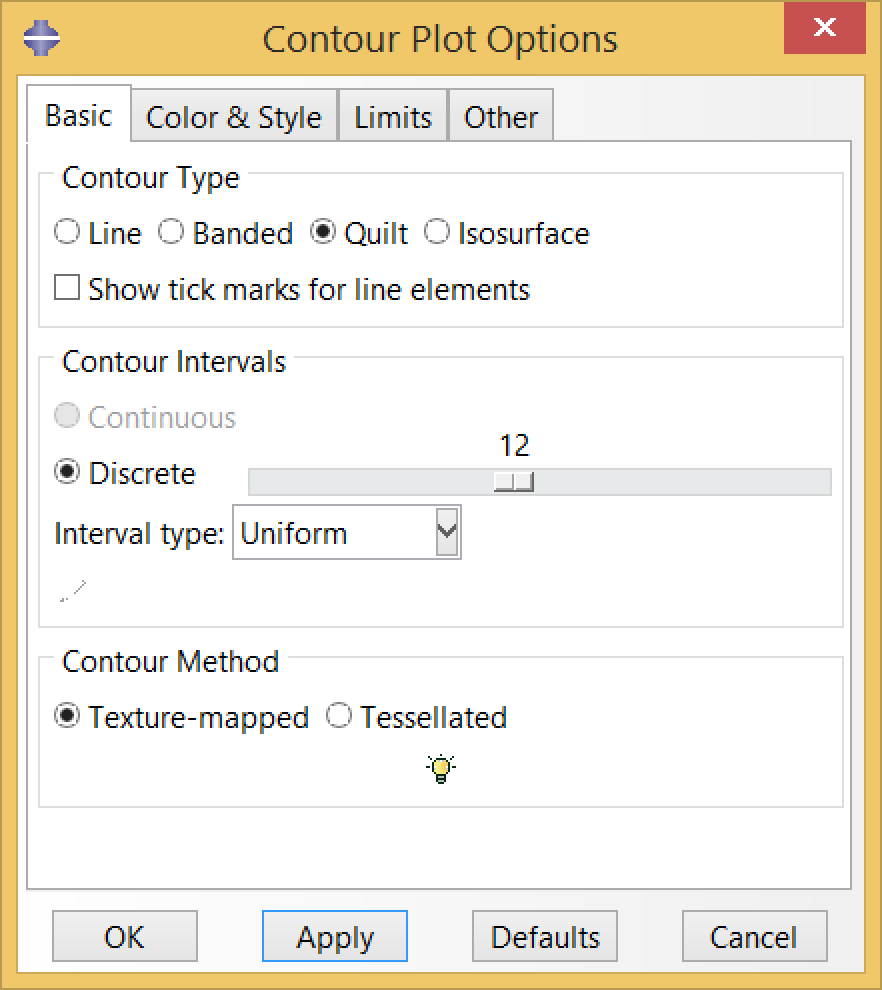
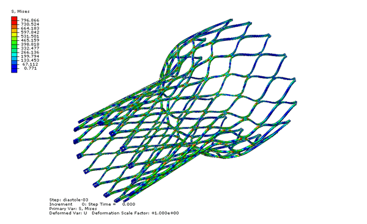
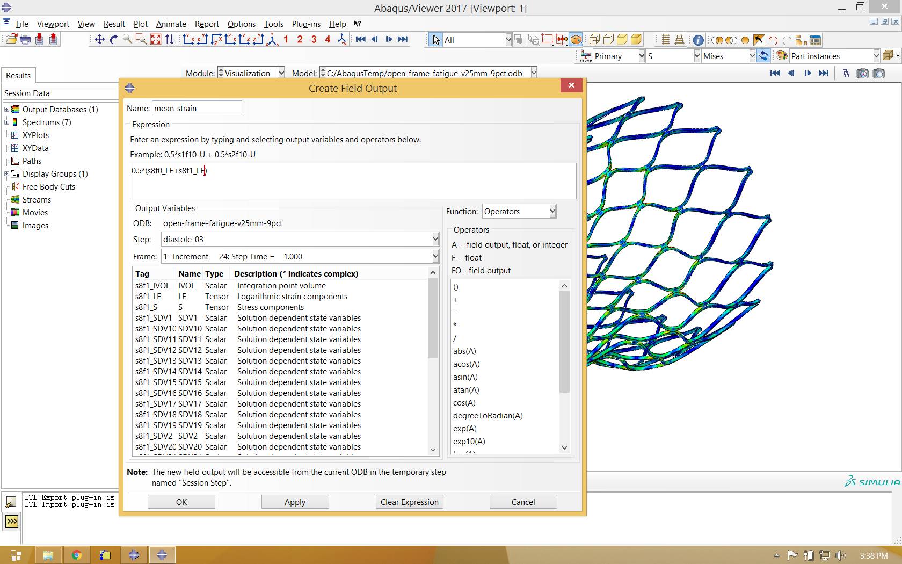
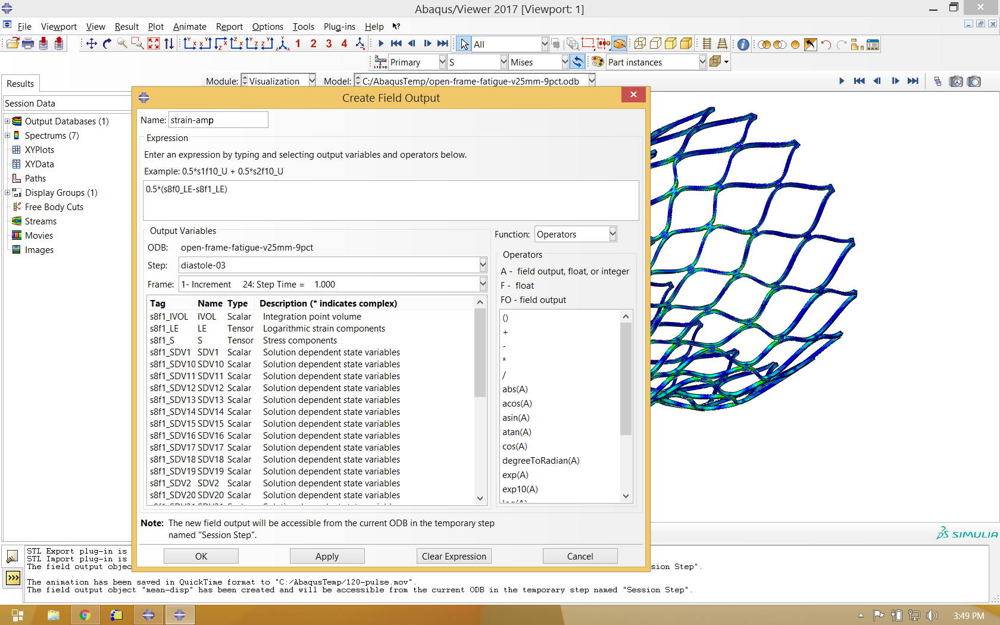
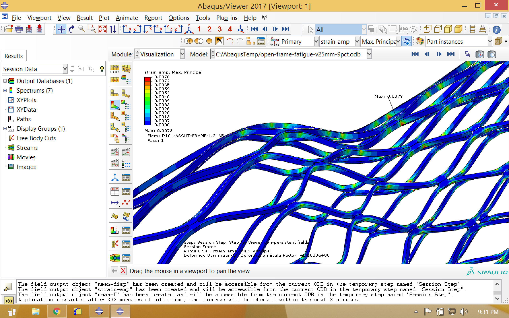
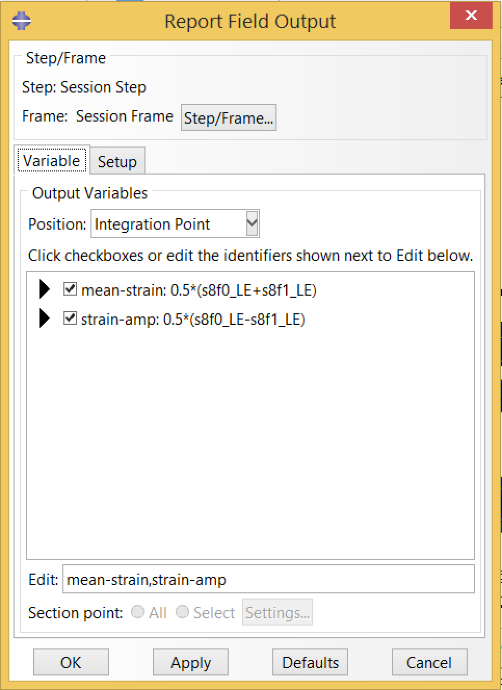
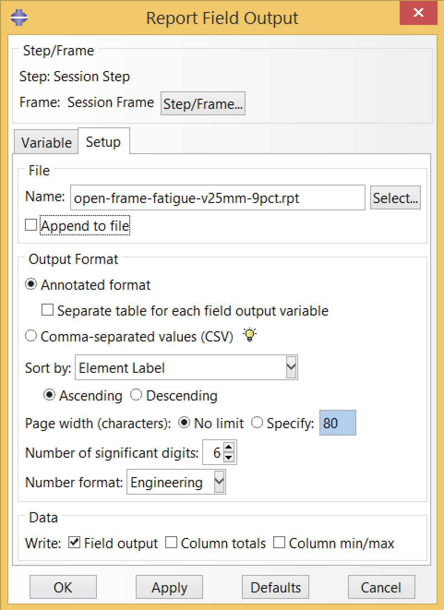
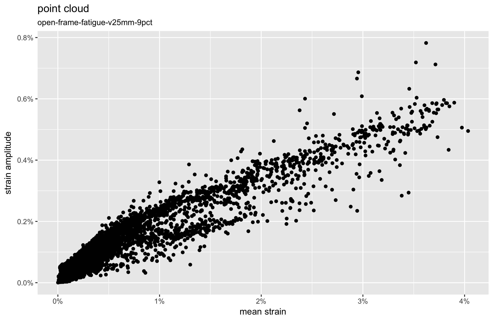

# Nitinol Component Fatigue Analysis

**Objective:** Deploy a nitinol component in a simulated use case, apply a fatigue loading condition, calculate mean strains and strain amplitudes, and create a "point cloud" to predict fatigue performance. 

**Prerequisites:** [Open Frame Design](../105-open-frame-design), [Open Frame Shape Set](../115-open-frame-shape-set), Simulia Abaqus 2017, [RStudio](https://www.rstudio.com/) (optional).

**Resources** The Abaqus CAE model database for this example can be downloaded from [this repository](https://github.com/cbonsig/nitinol-design-concepts/tree/master/120-open-frame-fatigue). The output database (65MB) can be downloaded from the 120-open-frame-fatigue folder at [nitinol.app.box.com/v/nitinol-design-concepts](https://nitinol.box.com/v/nitinol-design-concepts).

## Introduction

Superelastic nitinol has remarkable abilities to transform in shape, from large to small and back again. Intricate nitinol structures can also conform to complex anatomical constraints, and move with the body in an almost lifelike manner. Driven by increasing demand for minimally invasive medical treatments, nitinol components are deployed into demanding biomechanical environments like flexing limbs, and beating hearts. Designing for these fatigue conditions is a considerable challenge, and one we will begin to explore in this example.

In the most broad terms, any fatigue simulation includes three essential components:

1. **Geometry**: The shape and form of the component of interest. We typically start a nitinol fatigue simulation with geometry that represents the expanded shape of the component, with finished feature dimensions. This example will use nominal dimensions; tolerance variations are an important consideration that will be excluded from this example. We will start this simulation with the expanded geometry created in [Open Frame Shape Set](../115-open-frame-shape-set).

2. **Material**: Material properties and constitutive model. Here will will use the tensile properties described in [Material Characterization](../110-material-characterization), derived from the same tubing material from which the component is fabricated, subjected to the same heat treatments as the formed component as well. This simulation uses the superelasticity constitutive model that has been included with Abaqus for many years.

3. **Boundary Conditions**: This is often the most challenging of the three components, as realistic biomechanical boundary conditions can be difficult to know with confidence. Usually there are several different loading modes to consider (e.g. cardiovascular pulsatile pressure changes, bending or axial deformation related to the gait cycle, crushing related to the respiratory cycle). For this example, we will apply a single fictional radial deformation cycle, just to show how the process works.

## Geometry

In [Open Frame Shape Set](../115-open-frame-shape-set), we transformed a laser cut component from a starting diameter of 8mm to a complex expanded shape 28-40mm in diameter. The formed geometry at the end of this simulation will be be starting geometry at the beginning of this simulation. To begin, we will import the deformed geometry from the last frame of the final step of the forming analysis. `shape-set.odb` (91MB) can be downloaded from the 115-open-frame-shape-set folder of [https://nitinol.box.com/v/nitinol-design-concepts](https://nitinol.box.com/v/nitinol-design-concepts).


*Note: in this example, we are importing the nodes and elements only, and therefore we lose all of the information about stress and strain history, and more importantly we also lose information about the original material orientation. This will be relevant later, when we wish to relate the local orientation of inclusions with the local orientation of stresses. This example will be revised in the future to use a "\*RESTART" approach, which allows for preservation of the original material orientation through the fatigue simulation.*

In this example, we will constrain the expanded component to a small diameter, then deploy it into a chamber having a similar shape. In each fatigue cycle, the chamber will shrink in diameter by a specified radial displacement, then expand to a second larger diameter. This simple model is similar to a physical test that might be performed to challenge pulsatile fatigue performance of such a component. We create the geometry for this chamber as a part in Abaqus CAE, as shown below.


We also use Abaqus CAE to create a cylindrical surface to constrain the frame from its large to small configuration, and another to contact the inner surface at the minimum constrained diameter. Instances of all parts are created in an assembly as shown below.


## Material Properties and Boundary Conditions

The nitinol material properties used in this example are identical to those used previously in [Open Frame Shape Set](../115-open-frame-shape-set). 


This simulation represents fatigue conditions in the human body, so the environmental temperature will be set to 37 degrees C for the entire analysis. *(this will lead to conservatively high stresses during the initial crimping step, which in reality is likely performed at or below 22 degrees C)*


This simulation is driven by contact between the frame component, cylinders, and chamber. We typically use hard contact with setting as shown below.


Contact interactions are created and modified as necessary at each step in the simulation.


Boundary conditions are applied and modified as necessary to expand and contract the driving cylinders to crimp and deploy the stent. The diameter of the chamber is cycled between "systole" and "diastole" three times, allowing shakedown effects to stabilize.


These simulations can quickly generate many gigabytes of results! We try to keep file sizes reasonable by limiting the number of times the full field output results are written to the output database. Ultimately, full results are only needed for the final frame of the the final systole and diastole cycles. It is useful to also have some results for the prior steps to confirm that the model is working as expected.


## Visualizing Results

This simulation was required a total of about 2.7 CPU-hours on our system, and was completed in under 30 minutes of actual time using multiple CPU cores. The output database (65MB) can be downloaded from the 120-open-frame-fatigue folder at [nitinol.app.box.com/v/nitinol-design-concepts](https://nitinol.box.com/v/nitinol-design-concepts), and requires Abaqus 2017 CAE or Viewer to post-process.

We are only interested in visualizing the nitinol frame component, so we will first create a new display group. Select the nitinol part instance, and use this to replace the current selection.



Since the actual model is just a fraction of the real geometry, it is helpful to mirror and pattern the model to visualize the full frame.



When visualizing field outputs like stress and strain, by default Abaqus contour plots will extrapolate element field values to the nodes. We usually prefer to visualize element values directly. To do so, select "quilt" in contour plot options.



Now we can visualize the deformations, stresses, and strains associated with the fatigue cycle. The animation below cycles between stress of the "zeroth" increment of the final step, diastole-03 (which is actually the last increment of the previous step, systole-03). 



Our fatigue analysis will consider the mean strain and strain amplitude relating to the two increments shown in the animation above. To calculate these values, we will create new calculated field outputs by performing mathematical operations on the logarithmic strain tensors associated with these increments, as shown below. Note that the strain amplitude calculation introduces a sense of direction, as we are subtracting one tensor from another. As shown in the image below, we choose to subtract the last increment of diastole-03 from the zeroth increment, because the deformation is greater in the zeroth increment, and more relaxed in the last increment.




It is also helpful to use the same process to calculate average deformation during the fatigue cycle, and use this as the deformed variable when visualizing mean strain and strain amplitude.


Now we visualize our newly calculated field outputs, mean strain and strain amplitude, which are associated with a new step called "Session Step". In the images below, note that the location of the maximum strain amplitude is not the same as the location of the maximum mean strain. 




Finally, we will want to export the mean strain and strain amplitude values. To do so, we create a field output report using the options shown below, selecting Max Principal scalar for mean strain, and the Max Principal (Abs) scalar for strain amplitude.




The resulting report file, [open-frame-fatigue-v25mm-9pct.rpt](open-frame-fatigue-v25mm-9pct.rpt) is a table of mean strain and strain amplitude values at every integration point. The C3D8R elements used in this simulation have a single integration point per element, so this file has one row per element. 

## Point Cloud

Mean strain and strain amplitude results are commonly represented visually as a scatterplot called a "point cloud". Using a spreadsheet to create these plots becomes cumbersome quickly with large models. R is well suited to visualizing large datasets, so we'll create a short script, [point-cloud.R](point-cloud.R), to do the job.

```R
library(tidyverse) # http://r4ds.had.co.nz

# set working directory to location of this script
setwd(dirname(rstudioapi::getActiveDocumentContext()$path)) 

# read the field output results table
results <- read_table('open-frame-fatigue-v25mm-9pct.rpt', 
                      skip=19, col_names = FALSE)

# set names for the columns
colnames(results) <- c('elNum','intPt','eMean','eAmp')

# create a point cloud
pointCloud <- ggplot(results,aes(x=eMean,y=abs(eAmp))) +
  geom_point() +
  ylab('strain amplitude') +
  xlab('mean strain') +
  scale_y_continuous(labels = scales::percent) +
  scale_x_continuous(labels = scales::percent) +
  ggtitle('point cloud','open-frame-fatigue-v25mm-9pct')

# save as a PNG file
ggsave('point-cloud.png')
```


Here again, we can see that the maximum mean strain occurs at a different point from the maximum strain amplitude. We call this "point cloud divergence", and it is more likely to be seen as parts of the model experience high mean strains. This introduces some ambiguity about which point is actually most critical, a topic we will revisit in the next sections.

Note also that our field output report provided us with the *absolute* maximum principal scalar values for strain amplitude. This considers the absolute value of the *maximum* principal strain, and the absolute value of the *minimum* principal strain, and returns the larger of the two while preserving the sign. We will consider this subtlety more carefully in upcoming episodes, but for now we are simply plotting the absolute value.

## Credits

This model was developed by Karthikeyan Senthilnathan, [@karthikSenthi](https://github.com/karthikSenthi), of Confluent Medical Technologies. Learn more about fatigue properties of nitinol from Alan Pelton's 2011 [Nitinol Fatigue: A Review of Microstructures and Mechanisms](https://nitinol.com/wp-content/uploads/references/Pelton-2011-NiTi-Fatigue-Microstructures-and-Mechanisms1.pdf), and application to stents in Pelton, Schroeder, Mitchell, Gong, and Barney's 2008 [Fatigue and durability of Nitinol stents](https://nitinol.com/wp-content/uploads/references/144_Pelton_Schroeder_Mitchell_Gong_Barney_Robertson_2008.pdf), both available from the Confluent reference library at [nitinol.com](nitinol.com). Dordoni, Petrini, Wu, Migliavacca, Dubini, and Pennati also published a detailed stent simulation example in the 2015 [Computational Modeling to Predict Fatigue Behavior of NiTi Stents: What Do We Need?](https://www.ncbi.nlm.nih.gov/pmc/articles/PMC4493513/pdf/jfb-06-00299.pdf), open access via [PubMed Central](https://www.ncbi.nlm.nih.gov/pmc/).


