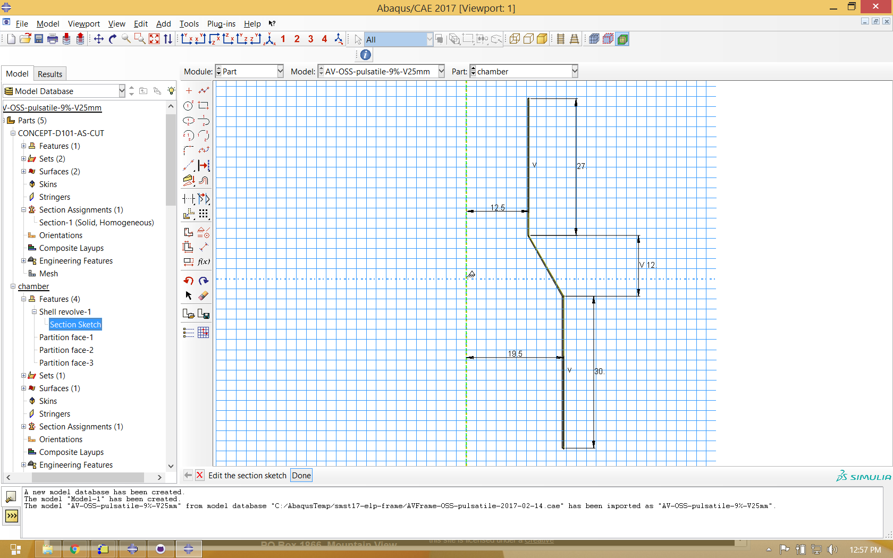
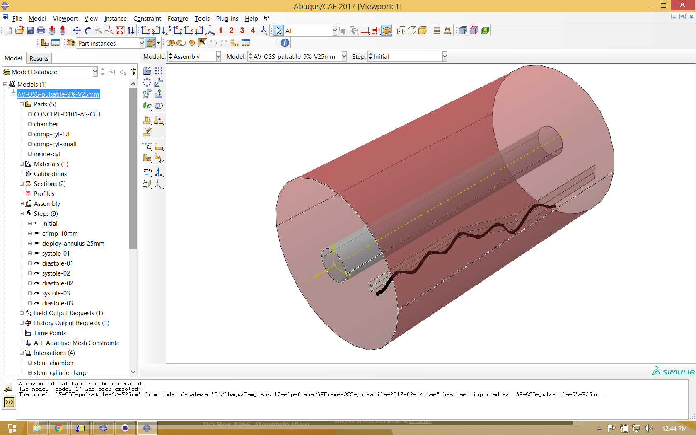
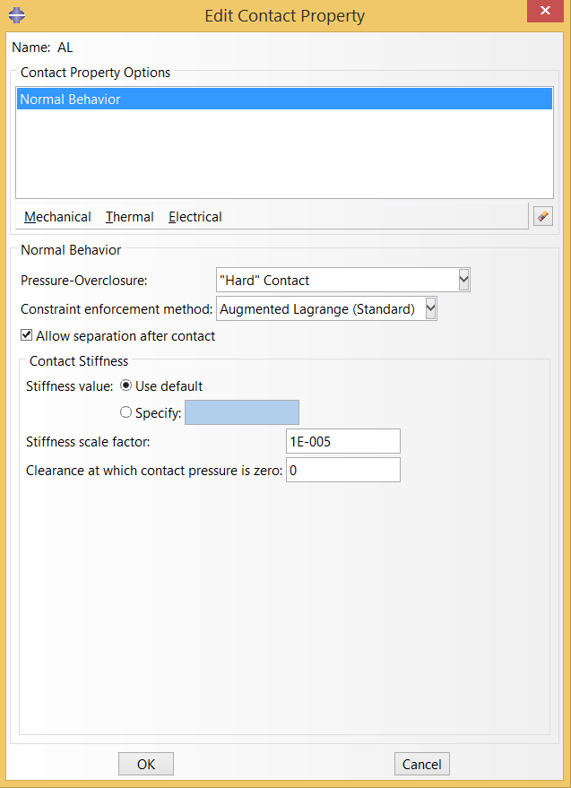
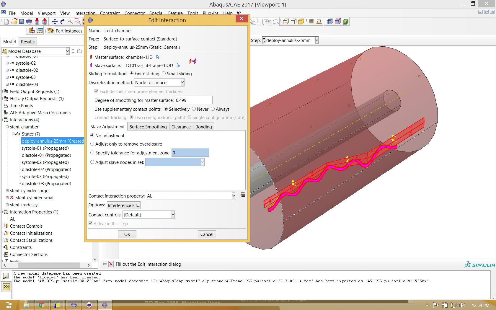
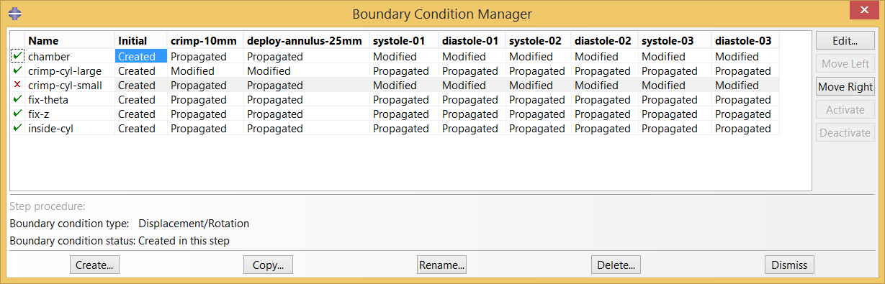

# Nitinol Component Fatigue Analysis

**Objective:** Deploy a nitinol component in a simulated use case, apply a fatigue loading condition, calculate mean strains and strain amplitudes, abd create a "point cloud" to predict fatigue performance. 

**Prerequisites:** [NDC-105 Open Frame Design](../105-open-frame-design), Simulia Abaqus 2017

**Resources** The Abaqus CAE model database for this example can be downloaded from [this repository](https://github.com/cbonsig/nitinol-design-concepts/tree/master/120-open-frame-fatigue). The output database (65MB) can be downloaded from the 120-open-frame-fatigue folder at [nitinol.app.box.com/v/nitinol-design-concepts](https://nitinol.box.com/v/nitinol-design-concepts).

## Introduction

Superelastic nitinol has remarkable abilities to transform in shape, from large to small and back again. Intricate nitinol structures can also conform to complex anatomical constraints, and move with the body in an almost lifelike manner. Driven by increasing demand for minimally invasive medical treatments, nitinol components are deployed into demanding biomechanical environments like flexing limbs, and beating hearts. Designing for these fatigue conditions is a considerabe challenge, and one we will begin to explore in this example.

In the most broad terms, any fatigue simulation includes three essential components:

1. **Geometry**: The shape and form of the component of interest. We typically start a nitinol fatigue simulation with geometry that represents the expanded shape of the component, with finished feature dimensions. This example will use nominal dimensions; tolerance variations are an important consideration that will be excluded from this example. We will strart this simulation with the expanded geometry created in [NDC-105 Open Frame Design](../105-open-frame-design).

2. **Material**: Material properties and constituitive model. Here will will use the material properties described in [NDC-110 Material Characterization](../110-material-characterization), derived from the same tubing material from which the component is fabricated, subjected to the same heat treatments as the formed component as well. This simulation uses the superelasticity constituitive model that has been included with Abaqus for many years.

3. **Boundary Conditions**: This is often the most challenging of the three components, as realistic biomechanical boundary conditions can be difficult to know with confidence. Usually there are several differnt loading modes to consider (e.g. cardiovascular pulsatile pressure changes, bending or axial deformation related to the gait cycle, crushing related to the respiratory cycle). For this example, we will apply a single fictional radial deformation cycle, just to show how the process works.

## TO > BE > CONTINUED

