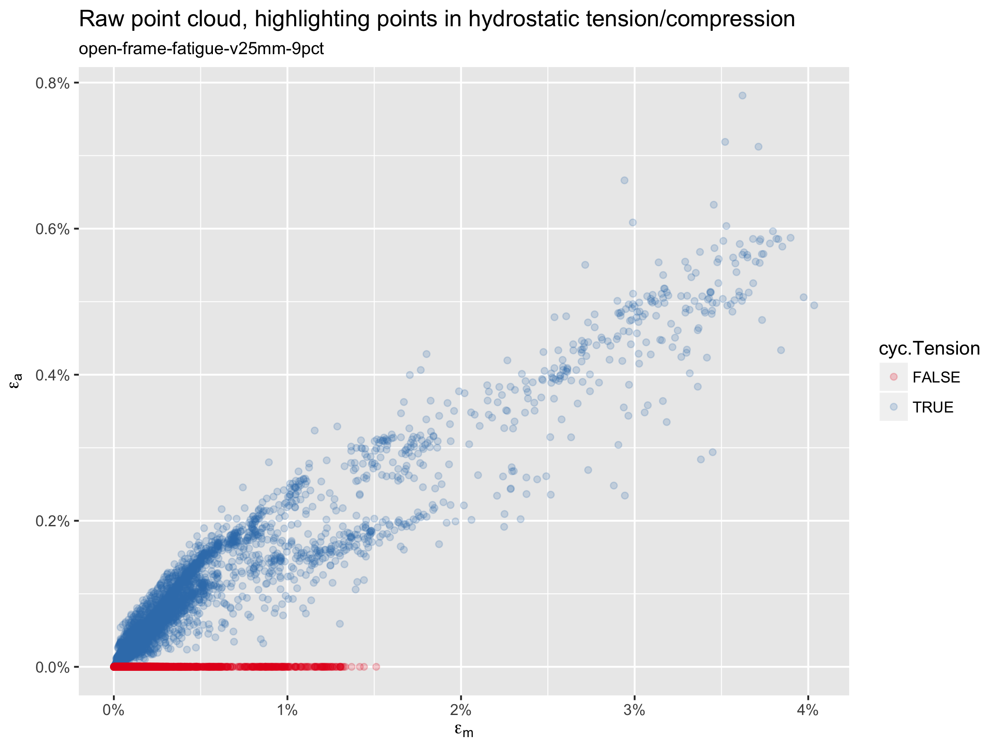
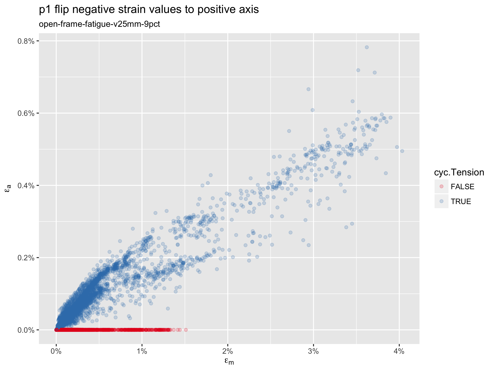
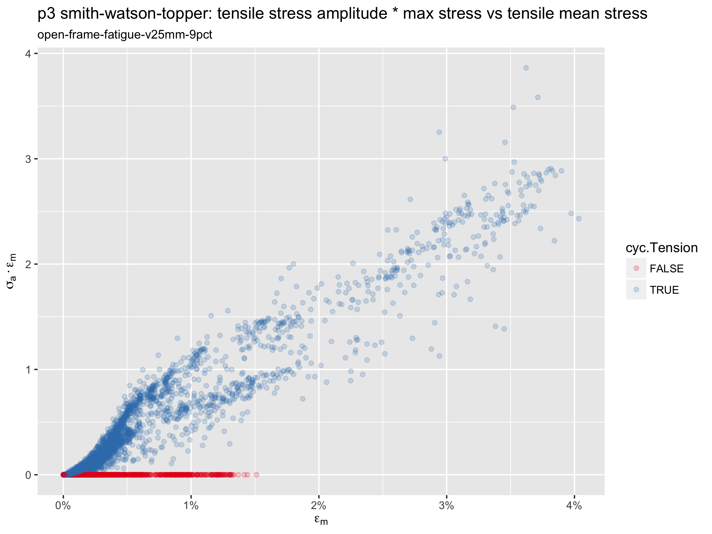
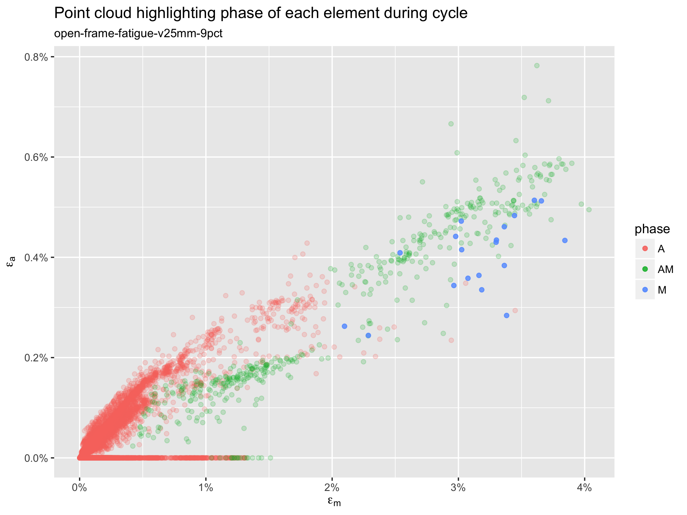
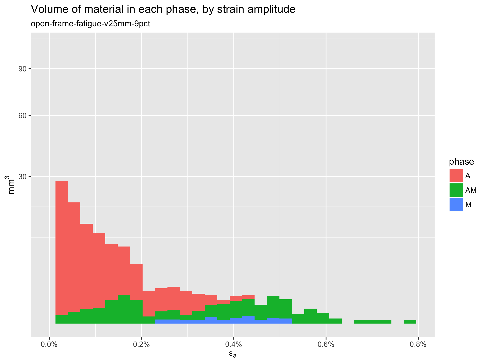

# Volumetric analysis of FEA results

**Objective:** Develop tools for volumetric assessment of cyclic stresses, strains, and phase changes related to the fatigue cycle.

**Prerequisites:** [Open Frame Design](../105-open-frame-design), [Open Frame Shape Set](../115-open-frame-shape-set), [Open Frame Fatigue Analysis](../120-open-frame-fatigue), Simulia Abaqus 2017, [RStudio](https://www.rstudio.com/)

**Resources** Python and R scripts used for this example can be found in [this repository](.). The output database (65MB) processed in this example can be downloaded from the 120-open-frame-fatigue folder at [nitinol.app.box.com/v/nitinol-design-concepts](https://nitinol.box.com/v/nitinol-design-concepts).

## Introduction

[Open Frame Fatigue Analysis](../120-open-frame-fatigue) concluded with extracting mean strain and strain amplitude from every integration point in the model, and creating a *point cloud* plot to asses the fatigue performance of the example design and loading condition. In this example, we will develop scripts to extract and analyze more information from the simulation, including volumetric measures or pre-strain, cyclic stress and strain, and phase changes.

## Simulation results

In [Open Frame Fatigue Analysis](../120-open-frame-fatigue), we created a finite element analysis simulation of crimping, deployment, and fatigue cycling of a generic nitinol frame component. If you followed along using Abaqus, you have already created the 65MB output database for this simulation. If not, the file can be downloaded from the 120-open-frame-fatigue folder at [nitinol.app.box.com/v/nitinol-design-concepts](https://nitinol.box.com/v/nitinol-design-concepts). The scripts in the following section will be used to process this ODB.

## Extract results with ivolResults.py

[ivolResults.py](ivolResults.004.py) is a Python script that can be used to extract useful information from the output database. Invoke the script as follows:

```sh
abq2017 python ivolResults.004.py
```
When invoked as above, it will return an overview of usage and requirements:
```
ivolResults.004.py
==================

A Python script to extract volumetric strain and stress results from Abaqus
output database(s). Calculates mean stress and strain, stress and strain amplitude,
prestrain and prestress, and associated volume at each integration point.
Exports data to a CSV file with one row per integration point.

Usage: abaqus python ivolResults.py
      -odbName odbName
      [-oldOdb crimpOdbName]
      -partInstance partInstanceName (name of part instance)
      -crimpStepName crimpStepName  (name of crimping/prestrain step)
      -lastStepName lastStepName  (name of final unloading cycle step)
      [-overwrite yes]

oldOdb is optional, and may be used if crimping (prestrain) results are in a
different ODB from cyclic results.  The script creates a CSV file with the same
job name as odbName, ending in .ivol.csv. If this file exists, script prompts
for a new file name. The "-overwrite yes" option will override this protection.
All other parameters are mandatory.

Field output requests must include strain, stress, state dependent variables,
and integration point volume:
LE, S, SDV, IVOL

See header of CSV file for a definition of all columns:

Example with all results in a single ODB:
abaqus python ivolResults.py -od Job-2 -pa PART-1-1 -cr crimp-1 -la unolad-3 -ov yes

Example with crimping and cyclic results in separate ODBs:
abaqus python ivolResults.py -od Job-2 -ol Job-1 -pa PART-1-1 -cr crimp-1 -la unolad-3 -ov yes
```
For this example, we created a simple shell script [getResults.sh](./getResults.sh) to run the script:
```getResults.sh
#!/bin/sh
abq2017 python ivolResults.004.py -odb open-frame-fatigue-v25mm-9pct.odb -pa D101-ASCUT-FRAME-1 -cr crimp-10mm -la diastole-03
```
Running this script will return a short summary of the results, and will also create a new CSV file [open-frame-fatigue-v25mm-9pct.ivol.csv](./open-frame-fatigue-v25mm-9pct.ivol.csv) 
```
Results from ivolResults.py
===========================
Output database:                        odb      = open-frame-fatigue-v25mm-9pct.odb
Crimping (prestrain) output database:   oldOdb   = open-frame-fatigue-v25mm-9pct.odb
Number of integration points:           nRows    = 9928
Total volume:                           vTotal   = 11.021
Maximum mean strain:                    cycEMmax = 0.0403436
Maximum strain amplitude (abs):         cycEAmax = 0.00782284

Output successfully written to the file: open-frame-fatigue-v25mm-9pct.ivol.csv
```
The CSV file header includes the same summary information, plus a description of each of the values that are calculated. Following this header, there is one row of output for every integration point in the selected part of the model. Looking at the first 50 lines of [open-frame-fatigue-v25mm-9pct.ivol.csv](./open-frame-fatigue-v25mm-9pct.ivol.csv), we can see a description of each of the columns, and the first few rows of data.
```
Results from ivolResults.py
===========================
Output database:                        odb      = open-frame-fatigue-v25mm-9pct.odb
Crimping (prestrain) output database:   oldOdb   = open-frame-fatigue-v25mm-9pct.odb
Number of integration points:           nRows    = 9928
Total volume:                           vTotal   = 11.021
Maximum mean strain:                    cycEMmax = 0.0403436
Maximum strain amplitude (abs):         cycEAmax = 0.00782284
-----------------------------------------------------------------------------------------------
el     = element number
ip     = integration point
cycEM  = maximum principal cyclic mean strain
cycEA  = absolute maximum principal cyclic strain amplitude
cycTau = cyclic maximum shear strain
cycSM  = maximum principal cyclic mean stress
cycSA  = absolute maximum principal cyclic stress amplitude
preE   = pre-strain (strain conditioning, e.g. strain during crimping)
preS   = pre-stress (stress conditioning, e.g. stress during crimping)
preP   = hydrostatic pressure during pre-conditioning (compression positive, tension negative)
preM   = volume fraction martensite during pre-conditioning
preV   = integration point volume during pre-conditioning
ldE    = maximum principal strain during loading frame of fatigue cycle
ldTau  = maximum shear strain during loading frame of fatigue cycle
ldS    = maximum principal stress during loading frame of fatigue cycle
ldP    = hydrostatic pressure during loading frame of fatigue cycle
ldM    = volume fraction martensite during loading frame of fatigue cycle
ldV    = integration point volume during loading frame of fatigue cycle
ulE    = maximum principal strain during unloading frame of fatigue cycle
ulTau  = maximum shear strain during unloading frame of fatigue cycle
ulS    = maximum principal stress during unloading frame of fatigue cycle
ulP    = hydrostatic pressure during unloading frame of fatigue cycle
ulM    = volume fraction martensite during unloading frame of fatigue cycle
ulV    = integration point volume during unloading frame of fatigue cycle
ldS11  = loading stress in material 1 direction (r)
ldS22  = loading stress in material 2 direction (theta)
ldS33  = loading stress in material 3 direction (Z)
ulS11  = unloading stress in material 1 direction (r)
ulS22  = unloading stress in material 2 direction (theta)
ulS33  = unloading stress in material 3 direction (Z)
ldE11  = loading strain in material 1 direction (r)
ldE22  = loading strain in material 2 direction (theta)
ldE33  = loading strain in material 3 direction (Z)
ulE11  = unloading strain in material 1 direction (r)
ulE22  = unloading strain in material 2 direction (theta)
ulE33  = unloading strain in material 3 direction (Z)
-----------------------------------------------------------------------------------------------
el, ip, cycEM, cycEA, cycTau, cycSM, cycSA, preE, preS, preP, preM, preV, ldE, ldTau, ldS, ldP, ldM, ldV, ulE,ulTau, ulS, ulP, ulM, ulV,ldS11, ldS22, ldS33, ulS11, ulS22, ulS33,ldE11, ldE22, ldE33, ulE11, ulE22, ulE33
1, 1,0.030131, 0.00456641, 0.00323904, 357.833, 119.528, 0.0738778, 776.797, -259.97, 1, 0.000992338, 0.0346601, 0.0259993, 477.241, -170.666, 0.526467, 0.000986772, 0.0256141, 0.0196029, 238.54, -82.2953, 0.449199, 0.000984664, 25.8648, 18.9629, 467.172, 9.20298, 6.32013, 231.363, -0.0144326, -0.015342, 0.0336961, -0.0110985, -0.0110985, -0.0110985
2, 1,0.0358662, 0.00540452, 0.00393214, 368.079, 122.357, 0.0790605, 920.482, -305.951, 1, 0.00102542, 0.0412302, 0.031955, 490.334, -192.046, 0.650705, 0.00101894, 0.0305153, 0.0241855, 245.921, -95.2945, 0.552342, 0.00101624, 74.8693, 20.3285, 480.939, 37.7665, 8.77036, 239.347, -0.0139181, -0.0213082, 0.0401197, -0.010619, -0.010619, -0.010619
3, 1,0.0381633, 0.00586188, 0.00426864, 372.964, 122.887, 0.0820324, 1007.88, -340.392, 1, 0.00106124, 0.0439823, 0.0337849, 495.751, -198.198, 0.698028, 0.0010536, 0.0323587, 0.0253476, 250.276, -101.539, 0.587902, 0.00105064, 79.3104, 29.0659, 486.219, 43.1876, 17.7542, 243.674, -0.0151119, -0.0223899, 0.0427704, -0.0115536, -0.0115536, -0.0115536
```
This Python script does everything that we did manually in [Open Frame Fatigue Analysis](../120-open-frame-fatigue), and quite a bit more. You should read through the [ivolResults.py](./ivolResults.004.py) code and comments to see how it works.

## Process results with postprocessFEA.R

If we were only interested in creating a point cloud, we could use a spreadsheet or a simple script like [point-cloud.R](../120-open-frame-fatigue/point-cloud.R). But now we have about 30 columns of results for thousands of integration points, and we're going to need some bigger guns. The [postprocessFEA.R](postprocessFEA.R) script is designed for this purpose. If you're new to R, it is an open-source statistical computing environment, with great tools for analyzing and processing large data sets. Download a copy from [RStudio](https://www.rstudio.com/), and learn more at [R for Data Science](http://r4ds.had.co.nz/).

If you are starting up R for the first time, you will need to install some packages before running postprocessFEA.R](postprocessFEA.R). Using the tool bar menu, select Tools > Install Packages. Type in `tidyverse, forcats` in the Packages field, and click install. 

Create a new project in RStudio and select New Directory. Copy [postprocessFEA.R](postprocessFEA.R) into the newly created directory, and open it in RStudio (File > Open File). Copy [open-frame-fatigue-v25mm-9pct.ivol.csv](./open-frame-fatigue-v25mm-9pct.ivol.csv) to that same directory. To run the R script, click the "Source" button at the top right of the code window. In a few seconds, it will create and save several plots in the [./png](./pdf) and [./pdf](./pdf) folders, and a summary of output information in the [./out](./out) folder.

## Filtered point cloud

In this script, we address some some considerations that we ignored in the simple point cloud created at the end of [Open Frame Fatigue Analysis](../120-open-frame-fatigue). We begin with by considering the hydrostatic pressure at each element, and coloring the points accordingly.



In this plot, the blue points are in hydrostatic tension for at least 90 percent of the fatigue cycle, and the red points are in compression. Note that the blue points are primarily those associated with a negative difference in maximum principal tensile strain, when the the "unloaded" fatigue frame strain tensor is subtracted from the "loaded" tensor. It is common to simply plot the absolute value of all of these points, which would flip the blue points to the positive axis. With this approach, we sometimes find that one of these "red" points has the overall highest strain amplitude, and thus appears to be most critical; in such cases, we would disregard such a result upon confirming that the element is in compression. To avoid this, the plot below sets all of the red points to have an effective strain amplitude of zero,



## Smith-Watson-Topper point cloud

The Smith-Watson-Topper (SWT) criterion considers the effects of mean stress in addition to strain amplitude. This approach is not yet commonly used to evaluate nitinol durability, but can easily be calculated and plotted using the results extracted from our model. SWT results can be compared with alternatives in future studies to determine if this approach offers prediction benefits.



## Phase transition point cloud

At a macroscopic scale, superelastic nitinol material is commonly understood to exist in an austenite phase at low stress, then transition to martensite as stress is applied, with a plateau in stress as strain increases, until the material is fully transformed to martensite. However, at the scale of individual atoms, the phase of the material is binary: either austenite (A) or martensite (M). It has been suggested that the transition between phases contributes damage in the material, and is therefore an important mechanism in fatigue durability.

Our computational simulation calculates the volume percentage of martensite at each integration point, and we also know the volume associated with each point. From this information, we can calculate the total volume of material in the M phase at each frame of our fatigue cycle. Not surprisingly, there is always a difference in volume, so we can therefore calculate the volume of material that is changing phase during the fatigue cycle.

It would be interesting to know which points are transforming during the cycle. To estimate this, we create a list of every integration point in the model, sorted by the calculated martensite volume fraction (SDV21) at that point. We start at the top of this list (at the point with the maximum value of SDV21), and assign that point to the M phase. We subtract the volume of this point from the total volume of M in the model, and move to the next point, repeating this classification until the total martensite volume has been accounted for. This process is completed for the loaded frame of the fatigue analysis, and repeated for the unloaded frame. Then, comparing the results for these two frames, we can classify each point as "always A", "always M", or "transitioning A/M" during the fatigue cycle. This result is plotted below in terms of a conventional strain amplitude vs. mean strain point cloud.



The above plot is somewhat surprising. If the A/M transition is in fact an important factor in fatigue durability, the most critical points are not necessarily those at the top right of a conventional point cloud. Rather, the A/M transition point, in green, span nearly the full range of mean strain and strain amplitude. Further study will be necessary to understand the possible implications of this to our understanding of durability prediction.

## Phase transition volumetric histogram

As we explore such implications, the resources here offer the ability to consider the material volume associated with the cyclic stress, strain, and phase changes. The plot below is an example of how we may visualize this information.



For example, this plot allows us to quantify the total volume of material that exceeds a given strain amplitude threshold. This may provide a useful measure of the amount of material that is "at risk" for a given design, and given loading condition. Furthermore, it provides an absolute measure that can be compared between different models, and/or loading conditions, possibly improving our ability to compare relative risk.

This plot is also colored to represent the estimated volume of material in each phase, as well as the volume of material that is transitioning A/M during the fatigue cycle. This information alone, or in combination with strain amplitude or SWT results, may provide additional insights into durability prediction, and will be investigated in future studies.

## Credits

These methods were developed by Craig Bonsignore, [@cbonsig](https://github.com/cbonsig), of Confluent Medical Technologies, and were inspired by numerous conversations Ali Shamimi, Karthik Senthilnathan, Tom Duerig, Nuno Rebelo, Alan Pelton, Mike Mitchell, among many others.

