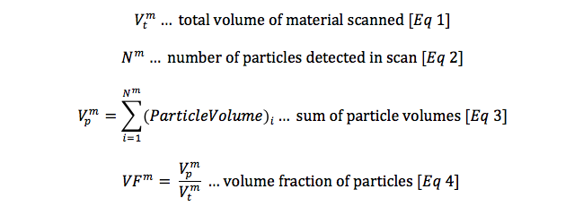

# Advancing Nitinol Fatigue Prediction

Author's manuscript [Present and Future Approaches to Lifetime Prediction of Superelastic Nitinol](http://dx.doi.org/10.1016/j.tafmec.2017.04.001), Craig Bonsignore, Confluent Medical Technologies. Published in *Theoretical and Applied Fracture Mechanics (2017)*.

## Introduction

Nickel-titanium, commonly known as nitinol, is a nearly equiatomic intermetallic compound of nickel and titanium. With suitable composition and processing, nitinol exhibits shape memory and superelastic properties related to a reversible temperature or stress induced martensite phase transition. For example, superelastic nitinol can be deformed to 10% strain, and recover to its original shape when the deformation force is released. This unusual property makes nitinol especially useful for minimally invasive medical applications, such as stents or heart valve frames, which must be inserted through a small access site and expand to a larger size at the treatment site.

Because of its unique properties, nitinol is often used in the most demanding endovascular and minimally invasive medical applications, commonly involving challenging fatigue loading conditions. For example, endovascular stents and stent-grafts must withstand 400 million cycles of arterial pressure, as well as non-pulsatile deformations related to respiration, gait, or other body motions. Heart valve frames must withstand a complex combination of forces related to the cardiac cycle and replacement valve configuration. Lifetime prediction for nitinol implants remains a challenging task for academics, industry and regulators. Despite extensive testing and simulation, nitinol implants are still reported to fracture in clinical service[1–3] without loss of intended functionality.

In this paper some of the reasons are explored for the challenges faced in lifetime prediction.  A typical workflow for durability assessment will be described and common mistakes and other sources of error highlighted.  

## Material Purity

Nitinol medical components are typically fabricated from commercially produced material compliant to ASTM F 2063 Standard Specification for Wrought Nickel-Titanium Shape Memory Alloys for Medical Devices and Surgical Implants[4]. This standard allows for nonmetallic inclusions (NMI’s), such as Ti2NiOx (x~0.5) or titanium carbide (TiC) particles and voids no larger than 39 microns in any dimension, nor exceeding an area fraction of 2.8% in any view at a 400-500x magnification. This standard applies to material in the form of mill product, 6-130 mm in diameter or thickness, in an annealed condition. There are no standards at present for material in forms commonly used to fabricate medical components, for example superelastic wire or tubing. These materials typically contain NMI's 5 microns or less[5], with an area fraction of 1% or less[6,7]. When material is converted to wire or tubing form, as commonly used for medical components, NMI’s may be broken into smaller pieces, leaving elongated clusters of particles and/or voids oriented in the axial (drawing) direction. These material inhomogeneities or discontinuities have been described as particle-void assemblies (PVA’s)[8].

It is commonly observed that fatigue fractures originate at the location of surface or near-surface inclusions or voids[8–10]. When these discontinuities are located in a critically stressed region of the geometry, stress and strain concentrate at the site of the defect and can initiate fracture. Industry, therefore, has invested considerable effort to develop material with fewer and smaller impurities[6]. High purity nitinol material has been shown to substantially improve durability performance in medical grade wire [11] and tubing material [12], particularly for the long life fatigue regime.

Medical device manufactures have recognized the relationship between material purity and durability performance. While durability is an important consideration, designs must also balance competing constraints such as stiffness, flexibility, and size. Many medical implant designs are constrained by durability requirements; heart valves, for example, are typically required to perform for at least 600,000,000 cardiac cycles. Demanding applications such as these now commonly specify high purity material, both to expand the design envelope and to increase reliability. For similar reasons, high purity materials are also commonly specified for nitinol medical components having fine feature sizes (100 microns or less). In these applications, the relative size of impurities compared with features size increases the possibility of structural failure. Consequently, high purity materials are also commonly specified for small nitinol components, such as those designed for neurovascular indications.

Suppliers continue to develop materials with higher purity, smaller inclusions, and fewer voids. For example, material is now offered with maximum NMI size less than 2.5 micron and area fraction of less than 0.15% [13]. New characterization techniques are also being developed to characterize the volumetric size and distribution of NMI's, as will be discussed below.

## Characterizing nitinol fatigue durability

In practice, the fatigue performance of nitinol medical components is characterized experimentally using test articles such as:
1.  finished nitinol components
2.  surrogate specimens, intended to reproduce the critical stress state of the actual component in a form more suitable for accelerated durability testing
3.  tensile specimens, intended to characterize mechanical properties and fundamental durability performance of the material.

Each type of specimen and experiment has unique advantages and limitations.

### Component Testing

Finished medical components are typically required to survive fatigue testing under conditions replicating *in-vivo* loading for a physiologically relevant number of cycles. The loading conditions and cycle count must be determined based on the physiology and biomechanics of the component, clinical indication, disease state, and patient population, and inclusion criteria. These loads must then be recreated in an accelerated physical test, which can be quite challenging. Often, multiple fatigue loads are superimposed: for example, a vascular implant may be subjected to loads related to systolic and diastolic pressures of the cardiac cycle coupled with the compression related to the respiratory cycle, or flexion related to the gait cycle. Understanding the relevant loads and cycles can be a challenge; in our experience, the root cause of most clinical component fractures can be traced to an incomplete understanding of the relevant *in-vivo* fatigue loads.

Finished component durability testing faces additional challenges beyond defining fatigue deformations and recreating them in a physical test: such testing is time consuming and expensive, and often controls the timeline for regulatory approval. Furthermore, given the nature of this testing, the total number of samples is typical limited to the order of tens of specimens. Therefore, it is typically not practical to test all extremes of product configurations, tolerances, loading ranges, or other known variables. Consequently, in finished component testing the stakes are, and surprises very costly. For these reasons, computational simulation is typically used to select and defend the conditions tested, to predict the outcome, and to optimize the design and allowable loading conditions in advance of testing.

Computational simulation, a separate frontier to be discussed later, predicts stresses and strains corresponding to applied loads or deflections of the component. These results must then be compared to some fatigue criteria for the material to predict the risk of fatigue fracture under the selected conditions. For nitinol, the fatigue criteria are not a simple factor that can be found in literature or a reference table. Rather, fatigue performance is dependent on the specific composition, thermal history, strain history, and surface conditions of the subject component. This brings us to the second category of fatigue testing: surrogate specimens.

### Surrogate specimen testing

Because of the time and cost of finished device testing, surrogate testing is usually invoked to improve statistical power and accelerate development.  The intent of surrogate testing is not to establish the fundamental material durability, but rather to simulate the stress states of the actual device as closely as possible, but in coupons that can be quickly tested. 

These specimens are typically designed to replicate critical features of the component itself, and are also designed to be reliably fixed in multi-station accelerated fatigue testing equipment, such as an Instron E3000 (R) or Bose ElectroForce (R) test instrument. Figure 2 illustrates a diamond shaped surrogate specimen, with strut dimensions matching those of a finished component, and grip features for secure placement in a testing instrument. This approach has been used successfully with diamond specimens laser cut from tubing, and with formed wire components as well[14,15]. Such specimens are fabricated from the same starting material as the component, and manufactured using the same cutting and forming processes, heat treatments, and surface treatments as the component. Typically tens to hundreds of these specimens are manufactured. 

A fatigue criterion is a mathematical model used to predict the risk of fracture for a given cyclic condition. Durability of classical engineering material is often described by the Goodman or Soderberg criteria, which defines a safety threshold in terms mean stress, stress amplitude for a given number of cycles. These simple criteria have been found to be invalid for nitinol[16], and industry has developed alternative fatigue criteria based on mean strain (epsilonm) and strain amplitude (epsilonm) tolerated at a given number of cycles. The fatigue criteria for a given nitinol application is often established by testing of surrogate specimens.

Relevant deformation conditions for surrogate specimens, typically expressed as target values for mean and cyclic strains, are selected to match those related to in-vivo deformations expected for the component. Typically computational simulations are first conducted for the finished component to establish the expected range strains related to loading conditions. Then, computational simulations are conducted on the surrogate specimen to establish the cyclic displacement required to match the mean strain and strain amplitude in the surrogate specimen with those in the component. This process is repeated for each of the conditions to be tested. Typically, several strain conditions are tested, including conditions within the expected operating range for the component, as well as conditions exceeding the expected operating range. Results at each condition are commonly represented on a strain limit diagram, with a fatigue threshold line drawn according to fracture or run-out results at various conditions[16,17]. 

### Tensile specimen testing

Tensile specimens, such as classical "dogbone" shaped test articles, are commonly used to characterize the stress-strain properties of the material. Properties derived from such testing are typically used to define material constants for computational simulation, so it is important that these samples also accurately represent the composition, thermal history, and strain history of finished component.

Tensile specimens can also be used to characterize fatigue durability of nitinol material. In displacement controlled tension-tension testing, a specimen is cycled between fixed displacements corresponding to target values of mean strain and strain amplitude for a specified number of cycles. Advantages and limitations of such testing are discussed below.

## Limitation of the strain limit diagram

While it is tempting to simply reference strain limit diagrams from literature, this is perilous for several reasons. First and foremost, the surrogate samples used for these published studies are not likely to match the material composition and process history of the subject component. Second, the loading conditions and strain distribution may not match the new component. Third, in some cases published strain limit diagrams mix results from different types of loading. For example, in a commonly cited strain limit diagram [16] reproduced in Figure 1, diamond surrogate specimens are mixed with tension-tension surrogate specimens, known to have a different lifetime. In a tension-tension fatigue test, the entire gage section of the tensile specimen is subjected to the target level cyclic strain, while a comparatively small focal region of a surrogate specimen experiences the target level of cyclic strain. Consequently, the amount of material exercised and therefore the risk of fracture is much greater in a tension-tension specimen compared with a surrogate specimen.

High mean strain conditions are particularly challenging to recreate in a reliable and repeatable fashion using surrogate specimens. This was the reason for using tension-tension specimens in the above referenced example.  

The strain limit diagram is intended to represent the risk of fracture at specific values of mean strain and strain amplitude for a given material composition, process, and number of cycles. This representation plots the maximum epsilonm and epsilona for each test, implying that the results represent strain values at that single point. This assumption may be true for a tension-tension test, wherein strain may be assumed to be uniform throughout the gage length but diamond-type surrogate specimens, as pictured in Figure 2 are dominated by bending. In this situation, the target strain value represents a small region of material, likely represented by a single integration point. The vast majority of the specimen experiences a range of sub-critical epsilonm and epsilona values, most much closer to zero strain than the target critical value. This is illustrated in Figure 3, which represents the strain at all locations of a strut targeting (epsilonm, epsilona) of (3.4%, 1.1%). This highlights one of the important limitations of a strain-limit diagram fatigue criterion derived from surrogate specimen testing: the points plotted on the diagram and used to draw the criterion line do not represent a single strain condition.

This limitation has a number of implications that challenge the predictive power of this approach. For some surrogate specimen geometries and loading conditions, it is possible for location of the maximum mean strain to differ from that of the maximum strain amplitude, as illustrated in Figure 4. Such cases are increasingly likely when targeting high mean strains, as some regions of the geometry are partially transformed, while other regions are fully transformed. This creates uncertainty about which point is most critical, which should be used as the plot location on a strain limit diagram, and which should be used to determine the crosshead displacement for the selected strain condition. 

One must also consider the implications of the volume of material subjected to the target strain conditions in each sample:  in a tension-tension test, the full volume of the gage length is nominally subjected to the same strain. The additive strain decomposition approach commonly used to model superelasticity [18][19] will report uniformly increasing strain in the gage length of a tension sample, with a uniformly increasing volume fraction of martensite as tension is increased. In reality, we know that local transformation is binary, initiating at several planes, forming Luders bands which grow and merge as tension is increased, and retreat as tension is released [20]. So while we may represent the mean strain and strain amplitude of a tension-tension surrogate sample on a strain limit diagram using a simple calculation based on global values, the actual local strains occurring at the transformation front are not easily known or reported.

## Toward a volumetric approach

Nitinol medical components are rarely subjected to tension-tension fatigue loading in clinical use. Rather, these components are dominated by bending, which is the reason for commonly using diamond shaped surrogate specimens. Here too, we have typically ignored the implications of the volume. In reality, for a diamond specimen (as with an actual component) a very small volume of material actually reaches critical mean strain and strain amplitude values. Yet the results of the entire sample are reported at a single location on the strain limit diagram, representing the entire sample by that small volume of critically strained material. And as described above, the method allows some ambiguity about how criticality is determined.

While the current practice has some clear limitations, it has served the medical device industry reasonably well, as countless patients and their families have benefited from effective and less invasive treatments for vascular diseases and other ailments. However, fatigue testing results remain notoriously difficult to predict with great accuracy. Computational modeling is quite good at predicting trends and relative outcomes, but challenges remain when attempting to predict absolute outcomes. The reality of fatigue testing (and clinical fatigue fractures) is dominated by high degree of scatter. Unexpected fractures can occur at a very low rate, and sometimes occur at a surprisingly low cycle count. Conversely, it is not uncommon for seemingly indestructible samples to last long beyond their predicted failure point. The computational simulation and analysis currently used by industry are not helpful in understanding or predicting this statistically complex reality.

A volumetric approach to material characterization, computational simulation, and analysis may offer some hope to address this challenge. To understand this approach, we can first propose a hypothesis, which is also visually described in Figure 5:

1.  A given nitinol material, in its finished form, has a measurable distribution of nonmetallic inclusions and voids, or particle-void assemblies (PVA’s). These can be characterized as particles with a statistical distribution of spatial location, volume, and shape.
2.  A given nitinol component (or surrogate specimen), subjected to a specific cyclic load or displacement, has a measurable distribution of critical strain regions. These can be characterized as particles with a distribution of spatial location, volume, and shape.
3.  All high cycle fatigue fractures in nitinol components nucleate at the location of a PVA.
4.  The risk of fracture is proportional to the probability of finding a PVA within a critical radius of a critical strain location.

### Volumetric characterization of material PVA's

Typically, material purity is measured and reported in terms of mass percentages by chemical analysis, and by area fraction by traditional two-dimensional metallographic cross sections. The statistical volumetric analysis proposed here requires a three-dimensional approach. Computed tomography methods have been used to quantify the volumetric distribution of inhomogenieties and PVA’s in steel and other materials [21,22]. Increasing resolution of commercially available X-ray computed tomography (XCT) instruments offer promise that these tools can be used to resolve NMI's and voids commonly found in nitinol material. Figure 6 shows a sample scan produced using a Zeiss Xradia Versa 520 (R) instrument, with a voxel resolution of 0.64 micron. Studies are currently underway to systemically characterize nitinol materials of various forms and grades, and report results in terms of volumetric statistics that may be used to test the hypothesis proposed here.

### Volumetric characterization of component critical strain regions

Computational models routinely report values such as stress and strain, but can also report the volume of material associated with the stress and strain at each integration point. The analyst can also establish one or more strain threshold values, and by considering the connectivity of associated elements, calculate the location, volume, and shape of each critical strain region exceeding the specified threshold. We have developed a Python script to perform these calculations [23] and some example results are shown in Figure 7. With this approach, we can calculate a volumetric distribution of critical strain regions as required by the second part of the above hypothesis. 

### All fatigue fractures originate at PVA’s

While this is an extreme statement, reports from the literature and our own experience evaluating fatigue fracture surfaces suggest that this assumption is usually true.

Fracture risk is proportional the chances of finding a PVA at or near a critical strain region

With these the first three assumptions satisfied, we can calculate a probability of fracture as a function of material purity from XCT analysis, combined with critical strain from computational simulation. In a simplified form, this can be calculated as follows, beginning with calculations derived from XCT:

A complimentary set of calculations can be derived from computational simulation:

Now, recognizing that the volume fraction of particles and critical regions are an expression of spatial probability for each, we can calculate a volumetric hazard probability H, the intersection of the volumetric probability of a particle with a critical region.

The volumetric hazard probability H incorporates information about material purity, geometry, and loading conditions. It can be expressed in terms of a percentage, or a parts-per-million (PPM) hazard rate, as commonly used in reliability statistics. This measure is therefore well suited to provide the analyst quantitative prediction for the influence of material purity on component durability for a given loading condition.

Table I provides an example use case for this approach, using fabricated but realistic data for a nitinol component made from standard vs. high purity material. The material values (Eq. 1-4) are estimated based on preliminary scans of standard purity and high purity nitinol tubing, considering only inclusions having a volume of 8 um3 or more. The component values (Eq 5-8) are taken from a laser cut nitinol component pictured in Figure 8. This component is fabricated from a 60mm length of 8.0mm x 7.0mm tubing, expanded to 28mm in diameter, and subjected to a displacement controlled fatigue cycle imposing and releasing a 9% diameter reduction. The total volume of material from which the component is fabricated Vtc is the tubing cross section (pi*((82-72)/4)mm2 multiplied by the length of 60mm. The number of critical regions N^c and total volume of these regions Vpc is derived from computational simulation. For this example, figure 8 shows the critical volume regions found by isolating elements exceeding a strain amplitude threshold of 0.4% during this fatigue cycle.

## Conclusions

This paper has highlighted some of the challenges currently faced by industry in predicting the fatigue durability of nitinol components. The most fundamental among them, understanding realistic biomechanical loads and boundary conditions, will likely continue to challenge designers for some time, as every device, disease state, and patient is unique. As higher purity materials become more widely utilized, and methods improve for characterizing these materials, we can expect fatigue performance to improve, and also expect designers to challenge improved durability limits with ever smaller components. Finally, there is great opportunity to improve our computational simulations, and to apply statistical thinking to our interpretation of results, and thereby improve our predictions and better assess risk of fracture.

## References

1. D. Scheinert, S. Scheinert, J. Sax, C. Piorkowski, S. Bräunlich, M. Ulrich, G. Biamino, A. Schmidt, Prevalence and clinical impact of stent fractures after femoropopliteal stenting, J. Am. Coll. Cardiol. 45 (2005) 312–315. doi:10.1016/j.jacc.2004.11.026.
2.  M. Chen, Y. Feng, H. Tang, Y.N. Xu, X. Wei, D.J. Huang, Strut fractures of CoreValve frames, Int. J. Cardiol. 163 (2013) e42–e43. doi:10.1016/j.ijcard.2012.09.004.
3.  S.L. Wang, A. Siddiqui, E. Rosenthal, Long-term complications of inferior vena cava filters, J. Vasc. Surg. Venous Lymphat. Disord. 5 (2017) 33–41. doi:10.1016/j.jvsv.2016.07.002.
4.  ASTM, F2633 Specification for Wrought Seamless Nickel-Titanium Shape Memory Alloy Tube for Medical Devices and Surgical Implants, (n.d.). doi:10.1520/f2633-13.
5.  M. Wohlschlögel, R. Steegmüller, A. Schüßler, Effect of Inclusion Size and Distribution on the Corrosion Behavior of Medical-Device Grade Nitinol Tubing, J. Mater. Eng. Perform. 23 (2014) 2635–2640. doi:10.1007/s11665-014-0996-6.
6.  M.F. Urbano, A. Cadelli, F. Sczerzenie, P. Luccarelli, S. Beretta, A. Coda, Inclusions Size-based Fatigue Life Prediction Model of NiTi Alloy for Biomedical Applications, Shape Mem. Superelasticity. 1 (2015) 1–12. doi:10.1007/s40830-015-0016-1.
7.  F. Sczerzenie, G. Vergani, C. Belden, The measurement of total inclusion content in nickel-titanium alloys, J. Mater. Eng. Perform. 21 (2012) 2578–2586. doi:10.1007/s11665-012-0377-y.
8.  M. Rahim, J. Frenzel, M. Frotscher, J. Pfetzing-Micklich, R. Steegmüller, M. Wohlschlögel, H. Mughrabi, G. Eggeler, Impurity levels and fatigue lives of pseudoelastic NiTi shape memory alloys, Acta Mater. 61 (2013) 3667–3686. doi:10.1016/j.actamat.2013.02.054.
9.  P.K. Kumar, C. Lasley, The influence of microcleanliness on the fatigue performance of nitinol, J. Mater. Eng. Perform. 23 (2014) 2457–2463. doi:10.1007/s11665-013-0857-8.
10.  J.A. Moore, D. Frankel, R. Prasannavenkatesan, A.G. Domel, G.B. Olson, W. Kam, A crystal plasticity-based study of the relationship between microstructure and ultra-high-cycle fatigue life in nickel titanium alloys, Int. J. Fatigue. 91 (2016) 183–194. doi:10.1016/j.ijfatigue.2016.06.006.
11.  M. Launey, S.W. Robertson, L. Vien, K. Senthilnathan, P. Chintapalli, A.R. Pelton, Influence of microstructural purity on the bending fatigue behavior of VAR-melted superelastic Nitinol, J. Mech. Behav. Biomed. Mater. 34 (2014) 181–186. doi:10.1016/j.jmbbm.2014.02.008.
12.  S.W. Robertson, M. Launey, O. Shelley, I. Ong, L. Vien, K. Senthilnathan, P. Saffari, S. Schlegel, A.R. Pelton, A statistical approach to understand the role of inclusions on the fatigue resistance of superelastic Nitinol wire and tubing, J. Mech. Behav. Biomed. Mater. 51 (2015) 119–131. doi:10.1016/j.jmbbm.2015.07.003.
13.  D.J. Frankel, G.B. Olson, Design of Heusler Precipitation Strengthened NiTi- and PdTi-Base SMAs for Cyclic Performance, Shape Mem. Superelasticity. 1 (2015) 162–179. doi:10.1007/s40830-015-0017-0.
14.  Z. Lin, K. Pike, M. Schlun, A. Zipse, J. Draper, Nitinol fatigue life for variable strain amplitude fatigue, J. Mater. Eng. Perform. 21 (2012) 2628–2632. doi:10.1007/s11665-012-0387-9.
15.  A. Zipse, M. Schlun, G. Dreher, J. Zum Gahr, N. Rebelo, Accelerated fatigue testing of stent-like diamond specimens, J. Mater. Eng. Perform. 20 (2011) 579–583. doi:10.1007/s11665-010-9794-y.
16.  A.R. Pelton, Nitinol Fatigue: A Review of Microstructures and Mechanisms, J. Mater. Eng. Perform. 20 (2011) 613–617. doi:10.1007/s11665-011-9864-9.
17.  A.R. Pelton, V. Schroeder, M.R. Mitchell, X.-Y.Y. Gong, M. Barney, S.W. Robertson, Fatigue and durability of Nitinol stents, J Mech Behav Biomed Mater. 1 (2008) 153–164. doi:10.1016/j.jmbbm.2007.08.001.
18.  F. Auricchio, R.L. Taylor, J. Lubliner, Shape-memory alloys: macromodelling and numerical simulations of the superelastic behavior, Comput. Methods Appl. Mech. Eng. 146 (1997) 281–312. doi:10.1016/S0045-7825(96)01232-7.
19.  F. Auricchio, R.L. Taylor, Shape-memory alloys: modelling and numerical simulations of the finite-strain superelastic behavior, Comput. Methods Appl. Mech. Eng. 143 (1997) 175–194. doi:10.1016/S0045-7825(96)01147-4.
20.  L. Zheng, Y. He, Z. Moumni, Effects of Lüders-like bands on NiTi fatigue behaviors, Int. J. Solids Struct. 83 (2015) 28–44. doi:10.1016/j.ijsolstr.2015.12.021.
21.  E. Maire, P.J. Withers, Quantitative X-ray tomography, Int. Mater. Rev. 59 (2014) 1–43. doi:10.1179/1743280413Y.0000000023.
22.  B. Harrer, J. Kastner, W. Winkler, H.P. Degischer, On the Detection of Inhomogeneities in Steel by Computed Tomography, Mater. Sci. (2008) 1–7.
23.  C. Bonsignore, strain-amplitude-volume-fraction Python script, Github.com. (2014). https://github.com/cbonsig/strain-amplitude-volume-fraction (accessed January 21, 2017).
24.  R. Guerchais, F. Morel, N. Saintier, Effect of defect size and shape on the high-cycle fatigue behavior, Int. J. Fatigue. (2016). doi:10.1016/j.ijfatigue.2016.12.010.
25.  a. Wormsen, G. Harkegard, A Novel Probabilistic Fatigue Assessment Tool and its Application to an Offshore Riser Joint, Procedia Mater. Sci. 3 (2014) 1210–1215. doi:10.1016/j.mspro.2014.06.197.
