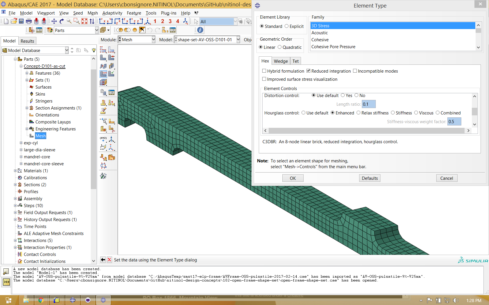
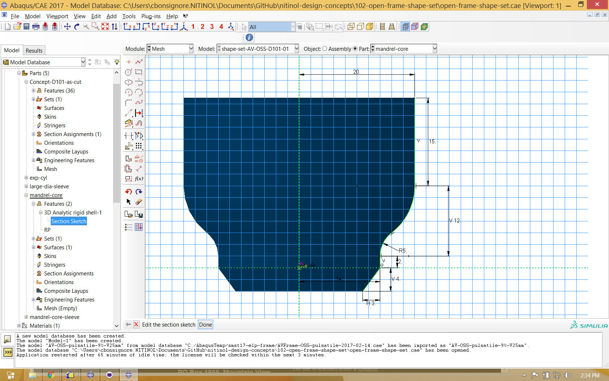

# Shape Setting

Objective: Expand a laser cut tubing component into a complex formed shape, using simulation to replicate the shape transformation in each physical heat treatment step. The output of this exercise is an expanded finite element model representing the finished component, and suitable for crimping or fatigue simulations.

Prerequisites: [NDC-110 Design](../105), [NDC-115 Mechanical Properties](../110), SIMULIA Abaqus 2017.

## Introduction

In [NDC-110 Design](../105) and [NDC-115 Mechanical Properties](../110), we created a design and characterized the material from which it is to be fabricated. Now it's time to dive into the world of computational simulation using finite element analysis (FEA), starting with an expansion analysis. 

We are often asked why use FEA to create expanded geometry; why not just create an expanded 3D geometry in Solidworks instead? Well, nitinol components are commonly formed in several steps, with intermediate heat treatments between each step. Each step imparts subtle influences in the shape, curvature, bend, and twist of design features that are difficult (or perhaps impossible) to replicate using conventional CAD. By matching the virtual expansion process step-for-step with the physical process, we can ensure that the virtual geometry is an accurate match with its physical counterpart. In fact, in a first iteration expansion simulation, a mismatch is quite common! The design, simulation, and prototyping cycle often includes adjustments to modeling assumptions (and/or physical tooling) to converge on a solution that matches the design intent. Let's get started!

## SIMULIA Abaqus

This example uses Abaqus 2017, a commercial finite element analysis package from Dassault Systèmes SIMULIA. This is the most widely used FEA package for nitinol computational simulation, and includes a material constituitive model designed specifically for unique characteristics of superelasticity. This model, based on the work of [Auricchio and Taylor](http://www.sciencedirect.com/science/article/pii/S0045782596011474) is based on a principle of additive strain decomposition. In this approach, the strain in each element can be a combination of an elastic, transformation, or plastic components. While there are more advanced constituitive models in development, the Abaqus implementation is well tested, robust, and still widely used. The superelasticity model can be used with Abaqus Standard for quasi-static simulations, or Abaqus Explicit for dynamic simulations. This example uses Standard, which is typically our first choice for nitinol medical component simulations.

We will assume that the reader is familiar with creating, running, and troubleshooting simulations in Abaqus, and we will not cover every detail of the model here. The original Abaqus CAE model files are available for download in this GitHub project, so please check them out and follow along.

## Import and Partition

The first step is to import and partition the ACIS (.SAT) file, in this case a single strut represently the smallest symmetrical repeating section of the component. The first objective is to split the imported geometry into well divided solid segments, thus enabling the meshing algorithm to create well formed hexagonal elements. This case required a few dozen partitions throughout the part geometry. This can be a bit tedious, and usually requires some iteration between the Part and Mesh modules until all the solid cells turn green or yellow, indicating their eligibility for ruled or swept meshing. 

## Mesh

In this example, the nitinol component is meshed with at least four elements across each feature, the absolute minimum for any simulation. Typically at least six to eigth elements are required to reach strain convergence. We typically use C3D8R elements, brick shaped elements with six faces, eight nodes, and a single centered integration point. Because this is a reduced integration element, it is prone to shear locking, so an hourglass stiffness must be applied to compensate for this (checking "enhanced" in the mesh control dialog is usually sufficient).

## Properties

discuss section defition, material definition, material orientation, etc.

## Forming Tools

Next, parts must be created to represent each of the forming tools that will be used to shape the component. In simple cases, these tools may be simple cylinders. Complex components may require contoured tools that engage the inner or outer surface of the component. Forming tools are typically modeled as rigid bodies, and may be defined as extruded or revolved surfaces as shown below. Each tool must have a reference point defined, as well as a surface to contact the nitinol component.

## Assembly

Each of the components is added to the assembly, and aligned in a colinear fashion. The image below is a partially transparent view of the assembly with each part positioned as necessary at the beginning of the simulation. In some cases, it may be necessary for tooling to expand (or contract) radially, and in some cases tooling may need to advance axially. The initial position of each tool relative the nitinol component will depend upon the forming strategy, and may also require some iteration as the simulation is developed.

## Interactions

Each step of the forming analysis is driven by contact interactions. Contact pairs are defined between the outer or inner surface of the nitinol component and the appropriate tool(s), and enabled or disabled as necessary at each step using the interaction manager as shown below.

## Boundary Conditions

As with the interactions, boundary conditions are created or modified for each step of the analysis.

## Field Outputs

For the expansion analysis, the only essential field output is displacement U for the final frame of the final step. It is usually also interesting to report strain LE and superelasticity internal state variables SDV as well, including at intermediate steps.
