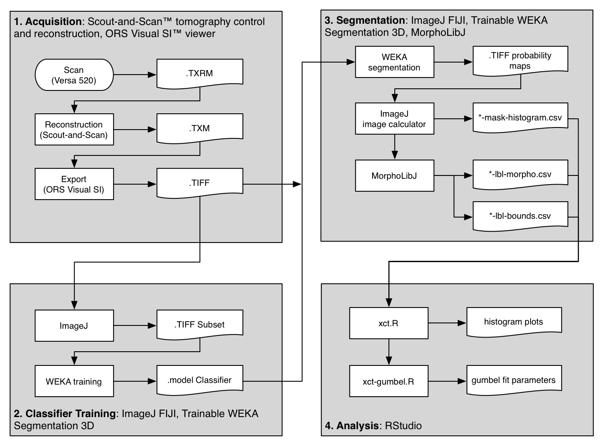
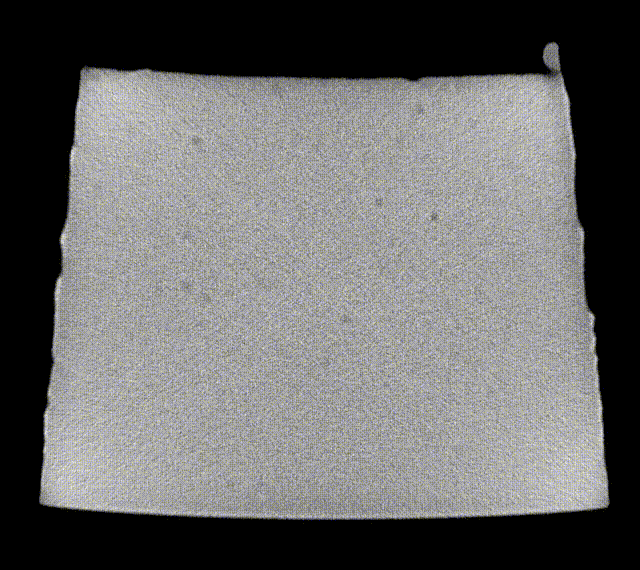
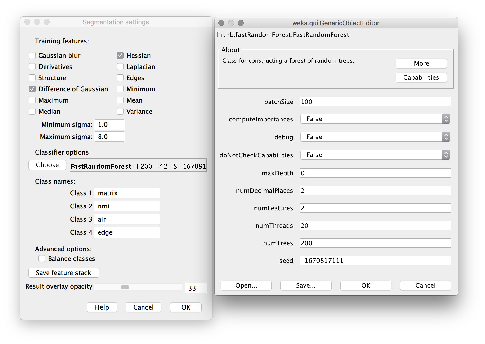

# Volumetric characterization of inclusions from submicron CT scans

**Objective:** Characterize the density, size, shape, and orientations of inclusions in a sample of nitinol material based on submicron resolution x-ray computed tomography scan results. 

**Prerequisites:** X-ray computed tomography microscope. This study utilized a [ZEISS Xradia 520 Versa instrument at Stanford Nano Shared Facilitiess](https://snsf.stanford.edu/equipment/xsa/xct.html).

## Introduction

[NDC-205 Advancing Nitinol Fatigue Durability Prediction](../205) reviews limitations of our current practice of fatigue lifetime prediction, and proposes some possibilities for advancing our predictive capabilities. Material purity (or conversely impurity) is an important factor in fatigue performance, as fractures virtually always originate at the location of a surface or near-surface impurity. Conventional metallurgical cross-sectioning techniques provide a two-dimensional view of impurities, typically in selected longitudinal and transverse planes. This information is useful, but can not be directly applied to a three dimensional structural analysis without making significant assumptions.

X-ray computed tomography (XCT) methods can provide a three-dimensional view of a sample volume of material. Until recently, sub-micron resolution XCT scans required a high energy beam source, such as a synchrotron, and were therefore inaccessible for routine characterization. We have found that modern commercially available XCT instruments are capable of resolving impurities commonly found in standard nitinol material. This exercise reviews methods used to obtain such an XCT scan for a nitinol tubing sample, and derive a "fingerprint" of the inclusions contained within.

##  Material

This study considers standard purity (SE508) and high purity (SE508ELI) material. Each specimen was fabricated from tubing material 8.00mm OD x 7.01mm ID according to NDC-03-06673 rev 1, “µCT Matchstick Samples”. Individual “matchstick” shaped samples have a cross section of approximately 0.5mm x 0.5mm, and are approximately 50mm in length. The lot history for each scan:
- `scan01`: SE508, Component Lot 2903620, Material Lot 1003492
- `scan02`: SE508ELI, Component Lot 2093619, Material Lot 1003560
- `scan03`: SE508ELI, Component Lot 2093617, Material Lot 1003711   

## Methods

The flowchart above shows an overview of the method used to scan and analyze three samples of material. The primary steps are outlined in gray boxes and described below.

### 1. Acquisition

XCT scans were performed using a [Versa 520 3D X-ray microscope](https://www.zeiss.com/microscopy/us/products/x-ray-microscopy/zeiss-xradia-520-versa.html) (Carl Zeiss X-Ray Microscopy, Inc., Pleasanton CA) at the [Stanford Nano Shared Facility (SNSF Center)](https://snsf.stanford.edu/). Matchstick samples were secured by a pin vice and placed into the XCT tool between the source and detector. Scan settings were as follows:
- 80 kV source voltage
- 4.00 W power
- 4x objective
- LE6 filter
- Z=-9.5 source position
- Z=54.25 detector position
- 0.501 micron voxel size
- 15 second exposure time per slice (16+ hours total acquisition time)

All scans were conducted and reconstructed using the same settings to ensure that results are consistent between samples. Each scan produced approximately 26GB of raw output in Xradia's TXRM format. Reconstruction was completed following recommended procedures to mitigate beam hardening artifacts. Gaussian filtering was applied with a 0.7 kernel, and the reconstruction was saved in TXM format, approximately 16GB in size. The TXM results were imported into [ORS Visual SI](http://theobjects.com/orsvisual/orsvisual.html) (Object Research Systems, Montreal, Quebec), cropped and exported as a sequence of approximately 2,000 16-bit gray-scale TIFF images, 7 GB in total size. All subsequent analysis was conducted using open source software.

*The original TIFF images from each scan are available for download at https://nitinol.app.box.com/v/nitinol-design-concepts*

### 2. Classifier Training

Scanning through the acquired images, after some simple adjustments to brightness and contrast levels, impurities in the material could be easily observed. The animation below show 50 slices from `scan01`. The dark spots are the inclusions that we need to systematically identify in each frame. This process is called "segmentation".

Image analysis was conducted using the [Fiji](https://fiji.sc/) distribution of [ImageJ](https://imagej.net), an open source software tool widely used for image processing and analysis. Conventional segmentation approaches require subjective judgments to select threshold levels, and often require manual adjustments to compensate for gradients or variations in background intensity. For this reason, repeatability and reproducibility is quite challenging. 

To overcome this challenge, a machine learning segmentation method was developed and applied to each scan in this series. The [Trainable WEKA Segmentation](http://imagej.net/Trainable_Weka_Segmentation) ImageJ plugin, included with Fiji, was used to segment assign each voxel a probability of being one of four classes:

1. **Matrix:** Nitinol material, including bulk nickel-titanium, as well as inclusions and/or voids.
2. **NMI:** Non-metallic inclusion, voids, or other embedded particles.
3. **Edge:** A trace of the border between matrix and air.
4. **Air:** Empty space surrounding the sample.

A 50-slice subset of the `scan01` image stack was used to train the model. The training process is manual and iterative, and each iteration requires computationally intensive processing. The following steps were first completed using a MacBook Pro Core i5 system with 16GB RAM.

1. Launch Fiji distribution of ImageJ
2. Open [scan01-0500-0549.tif](https://nitinol.box.com/s/7eywwq3ml46c0potmr4khkkah3elgfcv) (167MB 16-bit grayscale TIFF)
3. Adjust threshold to improve visibility of particles. Image > Adjust > Window/Level. Level should be set to about 50700, and Window to about 11000.
4. Launch Weka segmentation: Plugins > Segmentation > Trainable Weka Segmentation 3D
5. Create a total of four classes (click `Create new class` twice)
6. Click Settings. Apply settings and classifier options as shown below. (note: `numThreads` should be set to the number of available CPU cores; likely 2 or 4 on a personal computer, rather than 20 for a server as shown here.) 
7. Trace a path through the matrix (gray area) of the cross section, then click "add to matrix" in the label area at the right. Repeat this for several of the inclusions, the air, and the edge. Then repeat the process for multiple images in the stack (use the slider at the bottom to adjust the Z position). The image below shows an example training image for one frame. 
8. Click "Train Classifier", then go get at coffee. :coffee:
9. When complete, each pixel will be assigned a probability of belonging to each of the four classes. Review the result, and if there are obvious mismatches, add more training traces in the problematic area and retrain the model. Repeat until satisfied. 
10. The final classifier model and data used for this example can be downloaded from the [nitinol.app.box.com](https://nitinol.box.com/s/kcpbivbdszlqtx9zxsgkq636hfnzbo9p) site.

